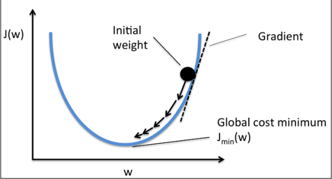
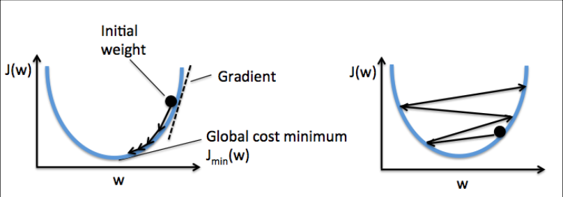
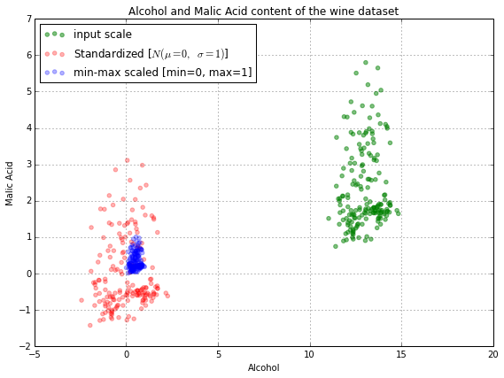
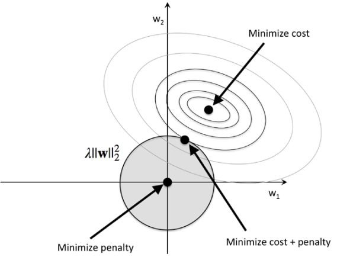
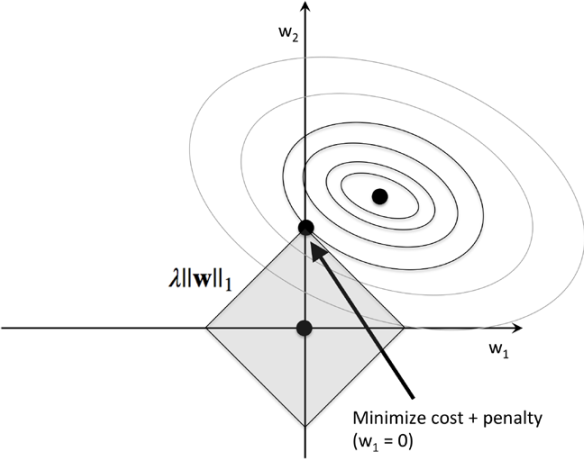

## Chapter 1 Giving Computers the Ability to Learn from Data

### 1.1 三种机器学习类型

#### **supervised learning**

- 分类：垃圾邮件检测（二分类）、手写体识别（多分类）
- 回归：学生成绩预测（学习时间--> 成绩），线性回归是拟合一个线性的模型

#### **unsupervised learning**

` 没有label，也没有reward function，从未知数据中获取有价值的信息 `

- 聚类  类间相似性小，类内相似性大。比如使用特征之间的距离来度量相似性
- 降维  把数据压缩到一个较小的子空间，同时又尽可能保持有价值的特征。降维也通常用于数据可视化，把高维数据映射到1~3维空间。

#### **reinforcement learning**

`增强学习通过与外界的交互，根据一个reward信号来不断学习，和supervised learning不同的是，增强学习不是使用groud-truth或者label的值来学习，而是对一系列action有一个measure值，最终做出的action能够最大化reward。`

- chess程序

### 1.2 数据表示

特征矩阵 : 行向量表示每个样本实例，每个列向量表示不同的特征。

### 1.3 机器学习流程

``` markdown
step1: Preprocessing，包括特征提取和scaling，特征选择、降维、采样
step2: Learning，包括模型选择则，交叉验证、Performance Metrics，Hyperparameter Optimization
step3: Evaluation
step4: Pridication
```

#### 1.3.1 Preprocessing

##### 1、为什么尺度要归一化？

​    

上图的方式如果不对归一化的话，左侧的收敛会很慢。再比如如果有两个特征，一个范围在[-5000,5000],一个在[10,20],


如果使用聚类算法，第一个特征对结果的影响可能比较大，然而两个特征的地位可能是相同的，因此要归一化。考虑affine invariance. 

[Wiki Feature-Scaling](https://www.wikiwand.com/en/Feature_scaling)

[why-feature-scaling](http://stackoverflow.com/questions/26225344/why-feature-scaling)

##### 2、为什么要降维？

有时候选择的特征之间的相关性高，出现冗余的特征，通过降维去掉相关的特征，不但可以降低存储空间，还能够提高学习速度。

##### 3、为什么要交叉验证？

学习的模型不但要在训练集上表现良好，也要在测试集上有很好的变现。避免出现overfit问题。通常把数据集随机分为训练集和测试集。

#### 1.3.2 Model Selection

1、为什么做模型选择？

No Free Lunch Theorems。每个分类算法都有一定的偏差，每个模型的好的效果表现都基于一定的假设，我们在选择模型的时候都通常选择几个模型进行比较，选择预测效果好的。

但是我们同样需要一个评价模型好坏的度量标准，常见的是分类精度（正确分类的比例）

2、如果我们不使用最终的测试集或者实际数据来进行模型选择，我们怎么知道那个模型在最终的测试集上性能较好呢，而且最终还是用测试集来评估模型性能？

使用交叉验证技术来评估模型的泛化能力。

#### 1.3.3 Evaluating Model

使用测试数据评估泛化误差

---

## Chapter2 Training Machine Learning Algorithms for Classfication

### 2.1 感知机

#### 2.1.1 感知机的推导

> http://www.cnblogs.com/MrLJC/p/4428443.html
>
> Loss Functin:误分类点到超平面的距离. 
>
> 沿着梯度下降方向,函数曲线是关于权重w的曲线,因为对于输入样本x是固定的,所以x看做是w的函数,w沿着梯度下降的方向可以使得Loss最小化.(之前一直想不明白主要是考虑的函数是关于x的函数.)


感知机的Loss函数是最小化误分类点的个数,权重的更新受误分类点的影响.考虑如下情况:

假设当前的权重为w,样本x值始终不变. 以其中一个特征分析$x_i$, 模型输出 $w_ix_i+b_i$ < 0 ,而实际应该>0,那么就需要增加一个$\delta$项 $x_i\Delta w$, 使得下次模型变为 $w_ix_i + b_i + \Delta w x_i$   , 那么只需让该$x_i\Delta w$项大于0 . 如果 $\Delta w  = \eta x_i$,那么 $x_i\Delta w = \eta x_i ^2$,显然增加的项是非负的.那么权重的更新的大小就可以定为 $\eta x_i$.  同理,如果实际应该< 0但是输出 >0的,需要减去一个非零项.

可以结合输出$y_i$,将两种综合起来得到权重的更新为:$(y_i-y_i')\eta x_i$.对于实际y=1的,$y_i-y_i' > 0 $,对于实际为y=-1的误分类点

$y_i - y_i' < 0 $


#### 2.1.2 感知机实现的步骤

- 初始化$w​$ 为0或者较小的随机数
- 对于每个输入的训练样本
  - 计算模型输出$y'$
  - 更新权重 $w_j = w_j + \Delta w_j$ ,其中$\Delta w_j = \eta(y^i-y'^i)x^i_j$

$\eta$是学习率，大小在0~1之间，模型输出$y'$ 值为+/-1.  观察更新规则可以发现，如果模型预测和实际一直，$w_j$是没有变化的，但是对于错误判断的项就会更新w

感知机收敛的前提是：数据是线性可分的。


### 2.2 Adaptive Linear Neurons(Adaline)

和Perceptron的不同:Adaline的权重更新是基于线性激活函数$\phi(w^Tx)$,而Perceptron的激活函数是单位阶跃函数.Adaline激活函数输出的是连续的值,变化比较平滑. 因此如果使用阶跃函数来定义权重更新规则,很有可能出现权重微小的调整导致结果出现反转,比如因为一个误分类点更新的权重虽然可以使该点在下次计算中被正确分类,但是很有可能会导致其他之前被正确分类的点再次被误分类,收敛速度较慢 .

#### 2.2.1 Adaline 推导

Adaline定义了损失函数,使用梯度下降法最小化损失函数.(这也是大多数机器学习算法的基本思路),并且损失函数一般定义都是凸函数.




这里使用的Cost函数是 Sum of Squred Errors. $J(w) = \frac{1}{2}\sum_i(y^{(i)}-\hat y^{(i)})^2 =  \frac{1}{2}\sum_i(y^{(i)}-   \phi(z^{(i)}))^2$ ,记住!这是关于w的函数.

权重更新沿着梯度的负方向(图示),这样可以走到极小值的位置. Adaline的激活函数比较简单,是个恒等函数 $\phi(z^{(i)}) = \phi(w^Tx) = w^Tx$

$\Delta w  = -\nabla J(w), w += \Delta w$,所以对每个$w_j$求导得

$\Delta w_j = -\eta\sum_i(y^{(i)}-\phi(z^{(i)})x^i_j$

#### 2.2.2 参数问题

##### 2.2.2.1 学习率大小的影响



如果学习率太多导致w变化太大,如有图,每次迭代可能跳到另一边,略过了最小值点,导致收敛很慢或者不收敛.

##### 2.2.2.2 Adaline的参数更新和Perceptron不同

- Adaline的每次参数更新 $\Delta w_j = -\eta\sum_i(y^{(i)}-\phi(z^{(i)})x^i_j$ 对每个$w_j$都使用了所有的训练样本的值来更新,在代码实现里面,   使用矩阵计算 $\Delta w  = \eta * X.T.dot(y-\phi(w^Tx))$ ,可以一次性更新所有的$w_j$,X转置后每行是特征j在每个样本i的值.
- Perceptron的计算在每轮迭代中,每次进来一个样本,$\Delta w_j = \eta(y^i-y'^i)x^i_j$ ,权重的更新只与当前样本i有关.

#### 2.2.3 特征scaling

通常将特征$X_j$ 归一化到符合标准正态分布, $X_j = (X_j-\mu_j) / \theta$ , $\mu_j$表示特征j在样本上的均值,$\theta$为方差,都可以通过numpy

的mean()和 std()函数求得.

可以发现归一化后比较高的学习率也可以收敛? 考虑两个特征f1,f2,f1的尺度很大,f2的尺度很小.在进行权重更新时,对于f1特征来说,每次更新的步长对w1可能比较合适,但是对于w2来说步长就可能很大,导致f2特征上很难收敛.

即使通过Adaline训练完后所有样本可以分类正确,但是SSE还是大于0. (why)

#### 2.2.4 BGD 和 SGD

在Adaline更新中,每次更新权重都用到了所有的训练样本,比如$\Delta w_j = -\eta\sum_i(y^{(i)} - \phi(x^{(i)}_j*w_j))x^i_J$,每个x的第j个向量.当训练样本非常大的时候,权重更新计算量非常大.这种梯度下降方式称为 `BGD` 

所以引入随机梯度下降`SGD`,每次不计算所有的x,而是把x分成小块,每次取一块数据来更新权重,极端条件就是每次只取一个x^i来更新权重,$\Delta w_j = -\eta (y^{(i)} - \phi(x^{(i)}_j*w_j))x^i_j$ 

随机梯度下降可以近似看做梯度下降,在实际工作中因为更新频率较高往往更快的收敛. 对于BGD每次规规矩矩沿梯度负方向下降,误差面比较平滑.而SGD由于每次选取部分的样本,误差波动大,反而容易跳出局部极小值,达到比较好的效果.


##### 2.2.4.1 怎么让SGD获得更好效果?

为了使SGD获得更好的效果,训练样本顺序最好随机一些,通常在每轮训练之前要把数据shuffle一下(充分利用数据)

##### 2.2.4.2 SGD的学习率

SGD的学习率通常不是固定的(fixed),而是随着训练误差的下降学习率也在下降,也成为自适应学习率. 
$$
\eta = \frac{constant}{constant+number\ of\ epochs}
$$

##### 2.2.4.3 MiniBatch

miniBatch可以看做是把BGD应用到样本的子集上,如果miniBatch只有一个样本可以处理on-line情景了.

#### 2.2.5 实现AdalineSGD

##### 2.2.5.1 Tips

- shuffle数据：使用numpy.random.permutation(x)函数，参数设置为要扰动的数据的数量，比如len(y),相当于对索引就行shuffle，然后直接调用X[index],y[index]就可以得到打乱的数据
- 定义AdalineSGD中关键参数：
  - 学习率$\eta$
  - 权重$W$
  - n_iter 标示迭代训练的次数
  - 样本$X,y$
  - 误差error_, 记录每次更新后错误个数
  - Loss值 cost，记录每次更新后损失函数（代价函数）的值(平均Lost或者Sum lost)
  - isShuffle:标示是否需要打乱数据
- 定义AdalineSGD中关键函数：
  - 初始化init函数初始化关键参数
  - fit函数，最关键的学习函数，用于更新权重。返回一个学习器.(权重更新也可以单独列出一个函数)，本函数还可以记录每次更新过程cost、error值。用于图表分析。
  - net_input 计算当前模型输出，参数为X，输出$\hat y$ .$\hat y = W^T X$ 
  - activate函数 。在AdalineSGD中使用的激活函数是恒等函数$f(W^TX) = W^TX$
  - perdict 函数 。根据net_input的输出作为输入，来决定-1/+1输出

##### 2.2.5.2 自己实现过程记录

- 待定

---


## Chapter3 Machine Learning Classifiers Using Sklearn

#### 选择分类算法

`no free lunch`, 选择多种分类算法来比较，选择因素包括 特征的维数、是否线性可分、样本噪声的大小

常规的步骤：

1. 选择特征
2. 选择性能指标
3. 选择分类器和优化算法
4. 评估模型的性能
5. 调参。。。


#### 3.1 数据预处理

选择好要处理的特征，并将数据分为训练集和测试集合

**Warning!**

- 数据归一化调用`preprocessing.StandardScalar.fit(x)`函数来计算均值和方差，注意x如果是一维的话，必须reshape成二维。比如x.reshape(-1,1)或者x.reshpae(1,-1)
- `partial_fit` 方法适合`on-line`计算
- 使用同样的参数来transform 训练集和测试机。fit参数有train_data计算，该参数用来scaling test_data

#### 3.2 评价性能指标

`sklearn.metrics.accuracy_score(y_test,y_predict)`

- Precision,Accuracy,F1-Score
- AUC
- ROC

> [introduction-to-auc-and-roc](http://alexkong.net/2013/06/introduction-to-auc-and-roc/)
>
> http://www.dataschool.io/roc-curves-and-auc-explained/

#### 3.3 逻辑回归模型

$p(x) = P(y==1|x)$ ，p(x)表示给定特征x，输出属于正类的概率。正样本label为1，负样本label为0,样本特征维度为n。

$logit(p(x)) = \frac{p(x)}{1-p(x)}   =  \sum_{i}^{n} w_ix_i = \textbf{w}^T\textbf{x}$

http://www.dataschool.io/guide-to-logistic-regression/

LR采用的是极大似然进行参数估计，也就是说找到参数w,使得事件发生的概率最大。

逻辑回归的推导（待定）：

> it's fast, it's highly interpretable, it doesn't require input features to be scaled, it doesn't require any tuning, it's easy to regularize, and it outputs well-calibrated predicted probabilities.

**step1**: 对于二分类基本都是学习出一个超平面可以把两类分离开。对于Perceptron（或者Adaline）模型，只是关注了某个样本落在超平面哪一面（所以学习出来的平面也有很多个）来判断属于哪一类，**也即是说只关注了$W^TX$的符号**。对于该样本属于该类的可能性大小并未考虑。而大多数情况下我们更关注样本属于两类的概率。

       	1. 对于$y = W^TX$，$y>0$为正类，且$y$越大属于正类的概率越大，离分离面越远，置信度大。$P_+(x) \in (0.5,1]$
       	2. 反之亦然。$P_-(x) \in [0,0.5)$
       	3. $P_+ = P_- = 0.5$ 位于超平面。
       	4. **所以有没有一个函数可以把 `概率P(X)` 和 $F(X) = W^TX$ 的值对应起来** ?

**step2**: 由于P(X)的区间为$[0,1]$,而$F(X)$值域为$(-\infty,+\infty)$,所以找一个函数把P(X)可以映射到$(-\infty,+\infty)$,这里引入Odd 函数，也称为`让步率`，表征X属于正样本的概率相比属于负样本的比例。显然P(X)越大，Odds越大。根据P(X)也可以决定属于哪一类。
$$
Odd(P(X)) = \frac{P(X)}{1-P(X)}
$$
但是由于P(X)取值从$[0,1]$,Odd值域为$(0,+\infty)$。所以需要继续把值域扩展到$(-\infty,+\infty)$，所以引入`logit`函数 
$$
logit(X) =  log\frac{P(X)}{1-P(X)} \in (-\infty,+\infty)
$$
**step3**: 至此，我们就可以建立起P(X) 和 F(X) 的联系。
$$
W^TX = F(X) = logit(X) = log\frac{P(X)}{1-P(X)} 
$$
之前的激活函数$F(X)$我们输入样本X得到正负的输出，现在我们的激活函数转变为输入X,得到和概率P(X)相关的输出。

所以
$$
\frac{P(X)}{1-P(X)}  = e^{F(X)}\\

P(X) = \frac{e^{F(X)}}{1+e^{F(X)}} = \frac{1}{1+e^{-F(x)}} = \frac{1}{1+e^{-W^TX}}
$$


至此我们就导出了激活函数 $\pi(X) = P(X)  =  \frac{1}{1+e^{-W^TX}}$，也就是`logistic regression model`。

逻辑回归不仅仅可以可以预测label,而且可以预测属于每个类的概率，比如天气预测，概率就非常重要。

**sigmoid函数求导**
$$
\frac{\partial \phi(z)}{\partial z} = \phi(z)*(1-\phi(z))
$$
应用`极大似然估计参数`，似然函数为
$$
\prod_{i=1}^n [\pi(X^i)]^{y^i}[1 - \pi(X^i)]^{1-y^i}  \ \ \ \ \  ,y^i \in {(0,1)}
$$
Log似然
$$
L(W) = \sum_{i=1}^n(y^i\pi(X^i))+(1-y^i)(1-\pi(X^i))
$$


然后$\max L(W)$,利用梯度法或者牛顿法。


##### 3.3.2 Tips

1. 在LR的参数中C=1000的C，通过正则项来防止过拟合。C越小惩罚力度越大。overfitting可以看做是模型variance 太大，导致参数太多太复杂，而underfitting可认识为模型high bias

2. bias and variance

   http://scott.fortmann-roe.com/docs/BiasVariance.html


#### 3.4 SVM

感知机最小化误分类个数，解有多个（比如初始w不同，或者集合上有多种划分使得误分类最小）

但是svm根据最大化margin来求分离面，解是唯一的。

- 函数间隔：$\hat\gamma_i = y^{(i)}(wx^{(i)}+b)$

- 几何间隔：$\gamma_i = y^{i}(\frac{(wx^{(i)}+b)}{||w||})$

- 线性规划形式：
  $$
  \max_{w,b} \gamma \\
  s.t. \ y^{i}(\frac{(wx^{(i)}+b)}{||w||}) \ge \gamma \  \ for \ i=0,1,2...n
  $$
  用函数间隔表示为
  $$
  \max_{w,b} \hat\gamma\\
  s.t. y^{(i)}(wx^{(i)}+b) \ge \hat\gamma \ \   for\  i=0,1,2...n
  $$
  ​

  令$\hat\gamma = 1$ **Why?**

  ​

对于线性不可分，使用松弛变量。SVM相关推导推荐参考（李航统计机器学习P100）。

增加松弛变量后的最优化目标？
$$
max \frac{1}{2}||w||^2 + \sum_i\xi^{(i)} \\
s.t. y^{(i)}(wx^{(i)}+b) \ge 1-\xi^{(i)} \ \   for\  i=0,1,2...n
$$


#### 3.5 核SVM

异或运算的线性不可分。

SVC函数中的gamma的影响，C的影响。gamma在kernel是rbf,poly和sigmoid时有用。且gamma越大，对数据的拟合越好，但是泛化误差也增大了，决策边界不够soft。C也是


#### 3.6 决策树

树太深，overfitting。剪枝

##### 3.6.1 Maximizing information gain

信息增益，熵，条件熵

- ID3 基于信息增益最大选择特征
- C4.5 基于信息增益比最大选择特征
- CART算法。假定决策树为二叉树，结合基尼指数最小来选择划分。$(A_i,s)$ 固定特征选择划分点，然后选择所有特整理基尼最小的。基尼指数可以看做最小化误分类的概率

剪枝：损失函数最小$C_{\alpha}(T) = C(T) + \alpha|T|$,$C(T)$表示为学习的模型对训练数据的预测误差，$|T|$ 表示模型的复杂度

> http://www.cnblogs.com/pinard/p/6050306.html


#### 3.7 Random Forest

##### 3.7.1 过程

可以看做是决策树的集成学习。

step1：随机采样一堆样本(有放回抽样)

step2: 学习一个决策树（根据最大化信息增益或者最小化基尼指数）

step3:重复1,2 k次

step4: 组合k个树，predict根据k个树的预测结果进行投票，选择投票数最多的类标


##### 3.7.2 Tips：

- 关注的参数有：采样的样本的数量n，样本的特征的维数，决策树的个数K。比如n越大，选择的随机性就小了，学习到的模型容易overfitting.通常选择和train样本数相同。
- K为1时和决策树一样。
- n_job开启多少个核来计算。
- random_state？？？？？

#### 3.8 KNN

称为lazy learner,KNN并不学习一个判别函数，而是记住了训练集。

- `有参模型` Perceptron，LR，Linear SVM。都是给定参数模型，进行参数估计
- `无参模型` NolinearSVM，DecisionTree。其参数随着训练集增长。KNN属于无参数的模型，基于实例的学习

但是lazy learner在学习过程中不涉及cost（损失）

##### 3.8.1 过程

1. 选择好K近邻的K值和距离函数
2. 找到要分类样本的K紧邻
3. 根据K个近邻的label给测试样本分配label

缺点是计算复杂度随着训练样本的增长而增大。使用KD-Tree或者较少维度的特征可以减少计算复杂度。KDTree适用于样本数量大于维数的情况下，复杂度为$log(n)$

**KD-Tree建立及搜索过程？？？？？？**

KNN受维数灾难影响。再次回想下，在LR是我们通过正则化避免overfitting。但是对于DecisionTree，KNN并不合适。通过降维来避免维数灾难

### Chapter4 数据预处理

#### 4.1缺失值处理

实际的数据在采集过程中基本都会存在`缺失值`，**必须在使用数据之前对缺失值进行处理!**

##### 4.1.1 加载csv数据

使用pandas加载csv数据，加载到DataFrame结构中。

- read_csv既可以从文件中读取，也可以从StringIO的Buffer中读，也可以使用url方式。
- 使用DataFrame.isnull()输出每个值是否为空，isnull().sum()函数统计每个属性都有多少个空值

##### 4.1.2 去除空值

- df.dropna(axis=0)直接移除包含空值的行，axis=1移除列。
- how参数，subset参数

但是移除空值太多的话可能会损失重要的参数。

##### 4.1.3 缺失值填充

1. Imputer函数 进行均值填充（或者中值，众数）

#### 4.2 处理分类数据（特征）

有的特征数据存在大小关系，比如身高，年龄，但是有的数据无法比较大小，比如衣服的颜色。所以不能直接使用原始数据。

##### 4.2.1 KeyValue 映射转换数据

对原始数据建立数据映射关系，映射到新数据上。比如不同颜色对应不同的数值。

##### 4.2.2 OneHot Encoding

对于特征中的每个值使用二进制表示，每次都只有一个位被置位。

好处是：机器学习算法对特征的值都假定为数值处理，假定了数据是连续的，是可比较的。但是对于一些特征的值本身不存在比较关系，到底把1,2,3分配给red,bule还是yello呢？分配了就认为red < bule，不同的分配肯定导致不同的效果。

比如对于LR的权重更新中$\frac{\partial \phi(z)}{\partial z} = \phi(z)*(1-\phi(z))$,显然x的每个特征都按值来处理,不同的映射规则导致权重更新也不一样，

或者adaline中$\Delta w_j = -\eta\sum_i(y^{(i)}-\phi(z^{(i)})x^i_j$,同样的模型，但是$\sum_i$的结果不一样，比如5组数据中2个red,2个yello,1个blue。按1,2,3和3,2,1分配显然权重变化不一样。


简单的KeyValue映射用在Label是因为学习算法处理Label认为就是无序的。

通过onehot,我们可以把颜色的三个值扩展到三个特征，然后0,1分别指示属于那种颜色。比如red扩展为(1,0,0)三个特征(伪特征)。

Example:http://stackoverflow.com/questions/17469835/one-hot-encoding-for-machine-learning

onehot对于涉及距离度量的也很有用，对于onehot,特征值之间的距离一样。[1,0,0],[0,1,0]和[0,0,1]距离都是$\sqrt2$

Tips：

- OneHotEncoder(指定列)，但是在使用OneHotEncoder时要先把string数字化，使用LabelEncoder-该函数主要处理label。
- OneHotEncoder返回的是一个稀疏矩阵。可以使用toarray()转换成普通矩阵(np.array). 也可以在初始化OneHotEncoder时指定参数sparse=False
- 也可以使用Pandas提供的函数实现onehot.  `get_dummies`

#### 4.3 划分训练集和测试集

#### 4.4 缩放特征到同一个尺度

1. normialization 把特征归一到[0,1]区间。即$x = \frac{x-min}{max-min}$,min-max sacling。在sklearn中为MinMaxScaler类。例子：图像处理中的对比拉伸
2. standardization。把特征归一到均值为0，方差为1的位置。即$x = \frac{x-\mu}{\delta}$ 。这种方法更为常用。另外standardlizaion保留了关于异常点有用的信息，使得学习到的模型对异常点不那么敏感。

为什么Normilization丢失信息了（比如outlier）

[linear-regression-normalization-vs-standardization](http://stackoverflow.com/questions/32108179/linear-regression-normalization-vs-standardization)




#### 4.5 选取合适的特征

##### 4.5.1 L1 和 L2

1. L1为什么会导致稀疏呢？

   >  https://www.quora.com/Why-is-L1-regularization-supposed-to-lead-to-sparsity-than-L2
   >
   >  http://stats.stackexchange.com/questions/45643/why-l1-norm-for-sparse-models

   所以L1可以找到特征中相干性强的特征。大多数的特征的系数为0



如上图，阴影区域表示增加正则项之后w的受限区域，一方面为了使loss最小化，w要向椭圆的中心点走，另一方面正则项把w往原点拉，所以minicost最终就是椭圆和阴影区域相交的点。

为什么正则项系数$\lambda$ 越大，阴影越小，对w的限制越强？

> 首先圆心在原点的圆的方程为 $w_1^2 + w_2^2 = R^2$,即$||w||^2 = R^2$
>
> 假设如果没有$\lambda||w||^2$正则项，那么$w$最终会到达椭圆中心点使损失函数最小，此时$w_1^2+w_2^2 = r^2$,$r^2$就是$||w||^2$的最大的值，为了防止$w$过大，增加了正则项，使得w小一点，即$\lambda||w||^2 \le r^2$,即$||w||^2 \le \frac{1}{\lambda}||r||^2$ ,所以$\lambda$越大，$R = \frac{1}{\sqrt{\lambda}}r$越小，w所在的圆越小。




而对于L1-norm来说，w受限区域比L1要小，且达到loss最小的时候w_1为0，如果在更高维的话，会有较多的特征系数趋向于0，所以L1会导致稀疏的系数。

##### 4.5.2 特征选择

特征选择是从原始n个特征中选择k个特征，是原始特征的一个子集.

1. 选择和问题相关性强的特征提高结果性能
2. 剔除无关的特征和噪声的特征，减少泛化误差（**对于不支持正则化的算法?**）

Sequential Backward Selection (SBS) 算法：从n个中取n-1个，求最大的，然后从n-1个中取n-2个，求准确率最大的。依次类推知道维度等于k

##### 4.5.3 特征提取

通过对原始特征进行信息抽取，构造新的特征空间,比如PCA降维

#### 4.6、通过随机森林评估特征的重要性

sklearn中提供的随机森林在fit之后可以提供各个特征的重要性分值。


1、SVM和LR的优劣

2、SVM 转换到 凸优化。

	1. 建模为凸优化
	2. dual

3、SVM kernel。